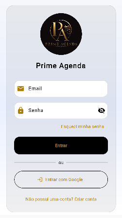
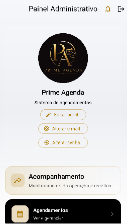
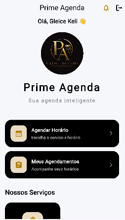

# ✨ Prime Agenda

Sistema de agendamento moderno desenvolvido para facilitar o gerenciamento de horários, clientes e serviços de forma prática e organizada.

O projeto foi criado com foco em experiência do usuário, responsividade e automação de agendamentos para negócios como barbearias, salões e atendimentos personalizados.

---

# 🚀 Funcionalidades

## 👤 Cliente
- Cadastro e login
- Agendamento de horários
- Escolha de serviços
- Visualização de horários disponíveis
- Histórico de agendamentos
- Interface moderna e intuitiva

## 🛠️ Administração
- Gerenciamento de clientes
- Controle de agendamentos
- Cadastro de serviços
- Upload de imagens
- Painel administrativo
- Atualização de horários e disponibilidade

---

# 💻 Tecnologias Utilizadas

- Flutter
- Dart
- Firebase Authentication
- Cloud Firestore
- Firebase Storage
- Material Design

---

# 🔥 Recursos do Sistema

- Autenticação de usuários
- Banco de dados em tempo real
- Armazenamento em nuvem
- Interface responsiva
- Integração com Firebase
- Gerenciamento de dados em tempo real

---

# 📱 Objetivo do Projeto

O Prime Agenda foi desenvolvido para oferecer uma solução prática e moderna para gerenciamento de agendamentos, ajudando negócios a organizarem atendimentos e melhorarem a experiência dos clientes.

---

# 📸 Screenshots

  
  
  

---

# ⚙️ Como executar o projeto

- Clone o repositório | git clone <https://github.com/Gleicekeli12/primeAgenda.git>

- Acesse a pasta | cd primeAgenda

- Instale as dependências | flutter pub get

- Execute o projeto | flutter run

---

# 📫 Contato
- LinkedIn: <https://www.linkedin.com/in/gleice-keli/>
- E-mail: gleicekeli8474@gmail.com
